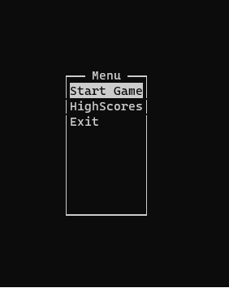
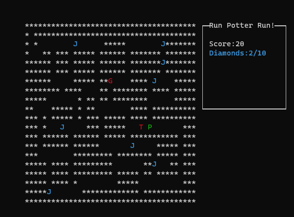
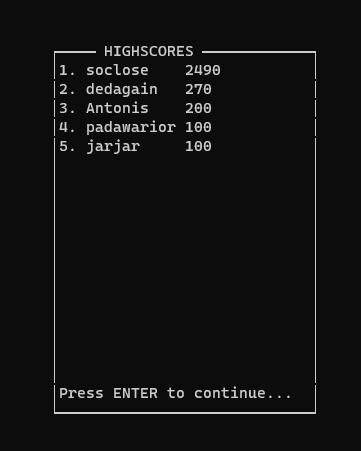

#### C++ Maze game using lib ncurses

A maze game using C++. For the GUI the library ncurses was used.

compile on POSIX platforms with:
```console
g++ ./src/*.cpp -o a.out -lncurses
```
and then run the game giving the map folder and the highscores file as arguments:
```console
./a.out ./assets/maps/map1.txt ./assets/scores.bin 
```

 

The player collects jewels to score points. After 10 jewels a scroll appears which gives `x10` points. The jewels and scroll are all randomly located each round. After the player collects the scroll a new round begins.

The player:
 - can move using the _arrow_ keys.
- stay still using _SPACE_ key.
 - exit the game using _ESC_ key.

 

The player is chased by one or two enemies depending on the difficulty.

The enemies find different shortest paths to the player using a _BFS algorithm_ on a grid system to surround the player.

After each play the player can enter his username and appear to the top 5 scoreboard.

 